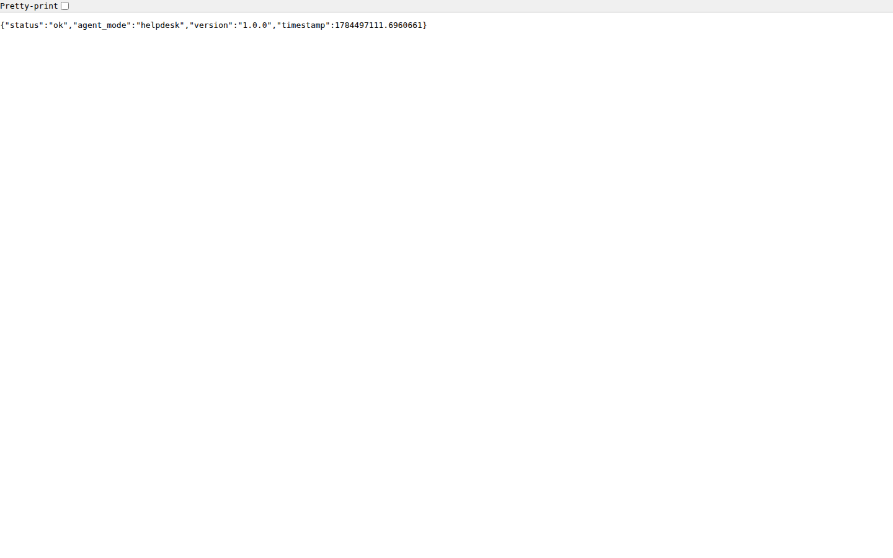
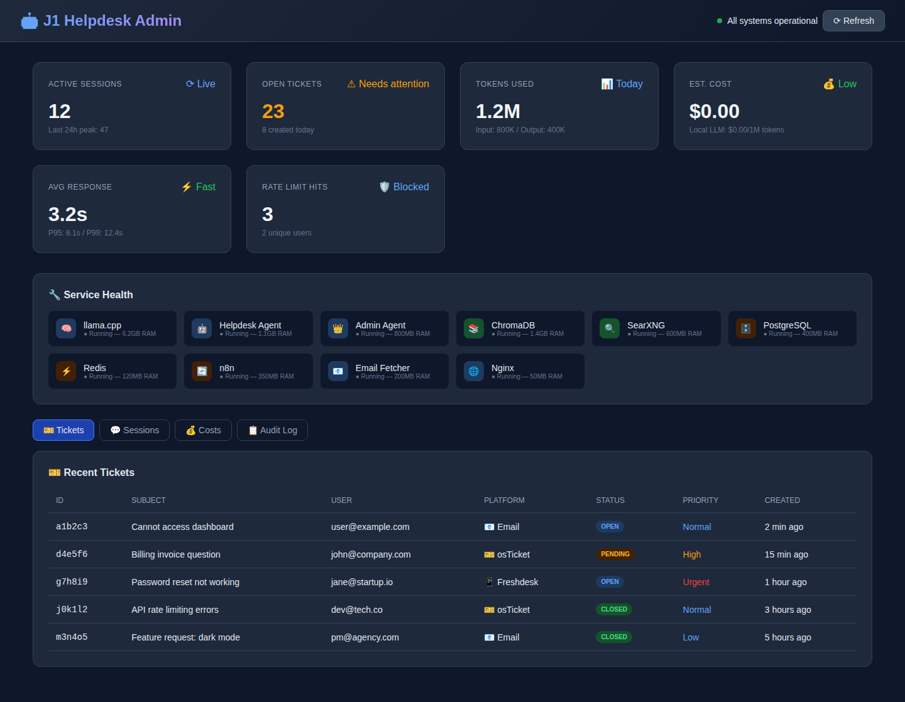
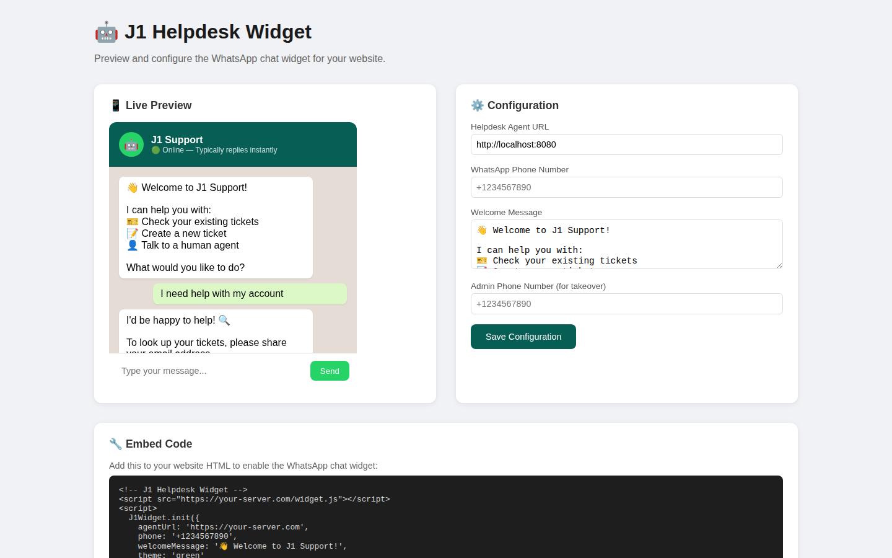

<div align="center">

  # 🎫 CommandDesk

  **Self-Hosted AI Helpdesk Agent**

  Multi-platform ticketing ingestion, an OpenAI-compatible AI chat agent, and an admin dashboard UI — self-hosted with Docker.

  [](https://opensource.org/licenses/MIT)
  [](https://www.python.org/)
  [](https://fastapi.tiangolo.com/)
  [](https://www.docker.com/)

  [Features](#-features) • [Quick Start](#-quick-start) • [Architecture](#-architecture) • [API](#-api-reference) • [Contributing](#-contributing)

</div>

---

## 📸 Screenshots

> Captured from the running services during this polish pass (real `agent_server` API response + the repo's actual dashboard/widget UIs).

<div align="center">

| Live API `/health` | Admin Dashboard UI | Chat Widget UI |
|--------------------|--------------------|----------------|
|  |  |  |

</div>

---

## ✨ Features

| Feature | Description |
|---------|-------------|
| 🤖 **AI Chat Agent** | FastAPI service exposing `/chat` — sends messages to an OpenAI-compatible LLM (llama.cpp / OpenAI / etc.) and returns responses |
| 🛡️ **Rate Limiting** | Per-session request caps, message-length limits, and sliding-window throttling (in-memory, Redis-backed) |
| 🎫 **Ticket Platform Integrations** | Pluggable connectors for osTicket, Zammad, Freshdesk, and email (IMAP) — see `ticket_platforms/` |
| 📧 **Email-to-Ticket** | `email_fetcher.py` polls IMAP and creates tickets via the platform API |
| 💬 **Web Chat Widget** | Static embeddable chat widget (`tools-ui/`) that talks to the agent API |
| 📊 **Admin Dashboard UI** | Standalone HTML dashboard prototype (`admin/admin-dashboard.html`) for ops/monitoring view |
| 🐳 **Docker Ready** | Multi-service `docker-compose.yml` (app + admin + llama.cpp + chroma + searxng + postgres + redis + n8n + nginx) |

> ⚠️ **Not yet implemented (described in older docs, not in code):** role-based auth (Admin/Agent/User), a server-rendered dashboard at `:8080`, and live cost tracking. The chat agent degrades gracefully (returns a fallback message) when no LLM endpoint is reachable.

---

## 🚀 Quick Start

### Prerequisites

- Docker & Docker Compose **or** Python 3.11+ and Redis
- An OpenAI-compatible LLM endpoint (llama.cpp, OpenAI, etc.) for real `/chat` replies

### Option A — Docker (full stack)

```bash
git clone https://github.com/OneByJorah/CommandDesk.git
cd CommandDesk
cp .env.example .env          # fill in secrets/paths
# Place a GGUF model at ./models (e.g. qwen2.5-7b-instruct-q4_k_m.gguf) for the llama.cpp service
docker compose up -d
```

This brings up the helpdesk agent on `:8080`, the admin agent on `:8082`, the admin dashboard behind nginx on `:80`, and the supporting services (llama.cpp, chroma, searxng, postgres, redis, n8n).

### Option B — Run the API locally (minimal)

```bash
git clone https://github.com/OneByJorah/CommandDesk.git
cd CommandDesk
python3 -m venv .venv && source .venv/bin/activate
pip install -r requirements.txt
docker run -d --name cd-redis -p 127.0.0.1:6379:6379 redis:7-alpine   # or any Redis
cd scripts
REDIS_URL=redis://127.0.0.1:6379/0 AGENT_MODE=helpdesk \
  python -m uvicorn agent_server:app --host 0.0.0.0 --port 8080
```

The API is verified running: `GET /health` returns `{"status":"ok",...}` and `POST /chat` accepts requests (replying with a fallback message when no LLM is configured).

### Environment Variables

| Variable | Default | Description |
|----------|---------|-------------|
| `REDIS_URL` | `redis://127.0.0.1:6379/0` | Redis for rate limiting / sessions |
| `LLM_API_BASE` | `http://llama:8081/v1` | OpenAI-compatible LLM base URL |
| `LLM_MODEL` | `qwen2.5-7b-instruct` | Model name for chat completions |
| `CHROMA_URL` | `http://chroma:8000` | Vector store for knowledge base |
| `SEARX_URL` | `http://searxng:8080` | Web search backend |
| `ALLOW_CREATE_TICKET` | `false` | Let the agent open new tickets |
| `AGENT_MODE` | `helpdesk` | Agent persona mode |

See `.env.example` for the full list (DB, Redis auth, IMAP, ticket-platform keys, JWT, etc.).

---

## 🏗️ Architecture

```
                        ┌─────────────────────────────┐
   Browser / Widget ──▶ │  agent_server (FastAPI)     │  :8080
                        │   /health  /chat  /session  │
                        └───────────┬─────────────────┘
                                    │
              ┌─────────┬───────────┼────────────┬──────────────┐
              ▼         ▼           ▼            ▼              ▼
          Redis    LLM (OpenAI-   Chroma     SearXNG      Ticket Platforms
         (rate     compatible,    (KB        (web         (osTicket / Zammad /
         limit)    llama.cpp)     vector)    search)       Freshdesk / Email)
```

- **Backend:** Python 3.11+, FastAPI, uvicorn, Redis (rate limiting & sessions)
- **LLM:** any OpenAI-compatible `/v1/chat/completions` endpoint (llama.cpp in the compose stack)
- **UIs:** `admin/admin-dashboard.html` (ops dashboard prototype) and `tools-ui/` (embeddable chat widget) — static front-ends that call the agent API
- **Deployment:** Docker Compose (10 services) or single-process via `uvicorn`

### Project Structure

```
CommandDesk/
├── scripts/              # FastAPI agent server + workers
│   ├── agent_server.py   # main API entry (/health, /chat, /session)
│   ├── rate_limiter.py   # per-session throttling
│   ├── session_manager.py
│   ├── email_fetcher.py  # IMAP -> ticket polling
│   └── whatsapp_webhook.py
├── ticket_platforms/     # osTicket, Zammad, Freshdesk, email connectors
├── admin/                # admin-dashboard.html (static UI)
├── tools-ui/             # embeddable chat widget (static)
├── config/               # system prompt, hermes/mcp configs, nginx, searxng
├── docker-compose.yml    # full stack
├── Dockerfile            # helpdesk/admin agent image
└── requirements.txt
```

---

## 🔌 API Reference

| Endpoint | Method | Description |
|----------|--------|-------------|
| `/health` | `GET` | Liveness/version (`{"status":"ok",...}`) |
| `/chat` | `POST` | `{user_id, message, session_id?, platform?}` → AI reply (degrades gracefully without LLM) |
| `/session/{id}` | `GET` | Rate-limit/session info for a session id |

### Example

```bash
# Health
curl http://localhost:8080/health

# Chat
curl -X POST http://localhost:8080/chat \
  -H "Content-Type: application/json" \
  -d '{"user_id":"alice","message":"My password reset email never arrived"}'
```

---

## 🧪 Testing

No automated test suite is included yet. A smoke check is the API health endpoint:

```bash
curl -f http://localhost:8080/health   # exits non-zero if the agent is down
```

---

## 🤝 Contributing

See [CONTRIBUTING.md](CONTRIBUTING.md). Issues and PRs welcome.

---

## 📄 License

MIT — see [LICENSE](LICENSE).

---

## 🔒 Security

See [SECURITY.md](SECURITY.md). No secrets are committed; configure everything via `.env` (use `.env.example` as a template).

---

<div align="center">

  **Built by [Jhonattan L. Jimenez](https://github.com/OneByJorah) under JorahOne LLC**

  More projects: [github.com/OneByJorah](https://github.com/OneByJorah)

</div>
