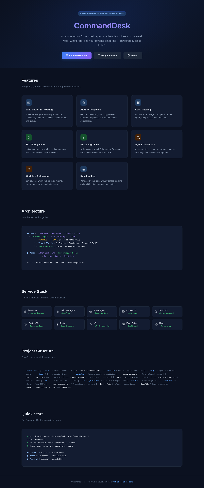

<div align="center">


# CommandDesk

**Helpdesk agent** (port 8080):

[](https://github.com/OneByJorah/CommandDesk/releases)
[](https://pypi.org/project/commanddesk/)
[](https://www.docker.com/)
[](https://www.python.org/downloads/)
[](https://opensource.org/licenses/MIT)

</div>



## What This Is

Self-hosted help desk and IT ticketing system — multi-user, knowledge base, SLA tracking, and customer portal with Docker Compose deployment.

Built for operators who want a self-hosted, Docker-deployed solution they control.

## Quick Start

### pip

```bash
pip install commanddesk
```

### Docker (recommended)

```bash
git clone https://github.com/OneByJorah/CommandDesk.git
cd CommandDesk
docker compose up -d
```

### From Source

```bash
git clone https://github.com/OneByJorah/CommandDesk.git
cd CommandDesk
pip install -r requirements.txt
python3 app.py
```

## Install

### pip

```bash
pip install commanddesk
```

### Docker

```bash
git clone https://github.com/OneByJorah/CommandDesk.git
cd CommandDesk
docker compose up -d
```

### From Source

```bash
git clone https://github.com/OneByJorah/CommandDesk.git
cd CommandDesk
pip install -r requirements.txt
python3 app.py
```

## Features

- **Self-hosted** — no cloud dependencies, run on your own hardware
- **Docker Compose** — full stack deployment with one command
- **pip package** — install via PyPI
- **Dark theme** — operational, clean UI

- **Help desk ticketing** — submit, track, and resolve tickets
- **Multi-user support** — agents, admins, customers
- **Knowledge base** — searchable articles and FAQs
- **SLA tracking** — response time monitoring
- **Customer portal** — self-service ticket submission
- **Docker Compose deployment** — full stack with one command
- **Dark theme dashboard** — operational, clean UI

## Tech Stack

- **Backend** — Python 3.11+, pydantic, pyyaml
- **Deployment** — Docker Compose, pip install
- **Configuration** — environment variables, config files

## Package Badges

[](https://github.com/OneByJorah/CommandDesk/releases)
[](https://pypi.org/project/commanddesk/)
[](https://www.docker.com/)
[](https://opensource.org/licenses/MIT)

## Contributing

Contributions are welcome. [Open an issue](https://github.com/OneByJorah/CommandDesk/issues) to report a bug or request a feature.

## License

MIT — see [LICENSE](LICENSE).
