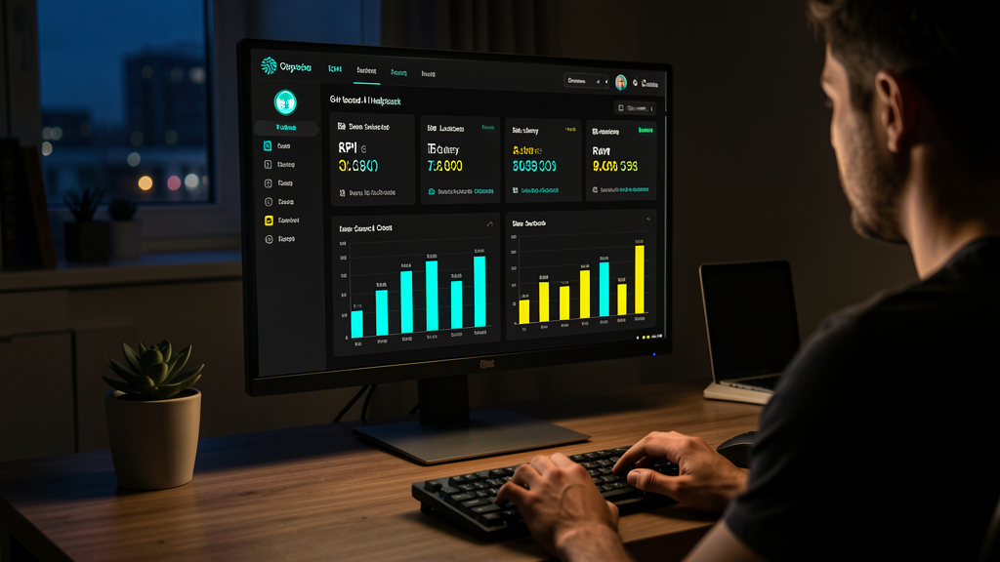

# CommandDesk

> Self-hosted AI helpdesk agent that ingests email, chat, WhatsApp, and tickets into one queue, answers from your knowledge base with a local LLM, and tracks the per-ticket AI cost in real time.

[](https://github.com/OneByJorah/CommandDesk)
[](https://github.com/OneByJorah/CommandDesk)
[](https://github.com/OneByJorah/CommandDesk/stargazers)
[](https://github.com/OneByJorah/CommandDesk/commits)
[](https://github.com/OneByJorah/CommandDesk/actions/workflows/ci.yml)



## What This Is

Helpdesk AI is usually a paid SaaS add-on that ships your ticket data off-premises. CommandDesk runs the whole pipeline locally: it ingests email and chat into a unified queue, answers from your own knowledge base using a local llama.cpp model (or the OpenAI API), and tracks the AI cost of every ticket. Humans can take over any conversation at any point, and n8n workflows handle routing, escalation, and satisfaction surveys.

## Quick Start

```bash
git clone https://github.com/OneByJorah/CommandDesk.git
cd CommandDesk
cp .env.example .env        # configure AI + email settings
docker compose up -d
```

| Service | URL |
|---|---|
| Dashboard (nginx) | http://localhost/dashboard/ |
| Widget preview | http://localhost:8484 |
| Agent API | http://localhost:8080 |
| WhatsApp webhook | http://localhost:9090 |

## Features

- Multi-platform queue: email, web widget, WhatsApp, osTicket, Freshdesk, and Zammad.
- AI responses via local llama.cpp or OpenAI GPT with context-aware replies.
- ChromaDB vector-search knowledge base over your own documentation.
- IMAP email-to-ticket ingestion.
- SLA definitions with automatic escalation on breach.
- Real-time AI cost tracking per ticket, per agent, per session.
- Per-session rate limiting with audit logging.
- n8n workflow automation for routing, escalation, surveys, and daily digests.
- Admin dashboard with live queue, metrics, audit log, and service health.

## Architecture

```
          User (WhatsApp / Web Widget / Email / API / Portal)
                              │
                    Helpdesk Agent (FastAPI :8080)
                    Session Mgmt · Rate Limiting · Routing
                     │          │               │
              ┌──────┴───┐  ┌───┴──────┐  ┌─────┴────────────┐
              │ LLM Core │  │ Context  │  │ Ticket Platforms │
              │llama.cpp │  │ChromaDB  │  │osTicket·Freshdesk│
              │ / OpenAI │  │· SearXNG │  │· Zammad · Email  │
              └──────────┘  └──────────┘  └──────────────────┘
                     │                            │
              Admin Dashboard              n8n Workflows
              PostgreSQL·Redis             Escalation·Surveys
```

## Stack

Python 3.10+ · FastAPI · llama.cpp / OpenAI · ChromaDB · PostgreSQL · Redis · SearXNG · n8n · Docker Compose · HTML/CSS.

## Contributing

See [CONTRIBUTING.md](CONTRIBUTING.md) and [CODE_OF_CONDUCT.md](CODE_OF_CONDUCT.md). [Open an issue](https://github.com/OneByJorah/CommandDesk/issues).

## License

MIT — see [LICENSE](LICENSE).
